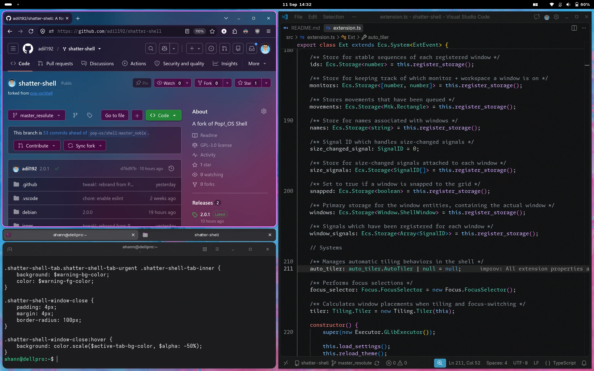

# Shatter Shell

Shatter Shell is a keyboard-driven layer for GNOME Shell which allows for quick and sensible navigation and management of windows. The core feature of Shatter Shell is the addition of advanced tiling window management — a feature that has been highly sought within our community. For many — ourselves included — i3wm has become the leading competitor to the GNOME desktop.

Tiling window management in GNOME is virtually nonexistent, which makes the desktop awkward to interact with when your needs exceed that of two windows at a given time. Luckily, GNOME Shell is an extensible desktop with the foundations that make it possible to implement a tiling window manager on top of the desktop.

Therefore, we see an opportunity here to advance the usability of the GNOME desktop to better accommodate the needs of our community with Shatter Shell. Advanced tiling window management is a must for the desktop, so we've merged i3-like tiling window management with the GNOME desktop for the best of both worlds.

[](https://raw.githubusercontent.com/adil192/shatter-shell/refs/heads/master_resolute/screenshot.webp)

## Fork notice

This is a fork of the original [pop-os/shell](https://github.com/pop-os/shell) repo,
which is no longer being developed<sup>[source](https://github.com/pop-os/shell/issues/1829#issuecomment-5511896163)</sup>.

Find a summary of this fork's main improvements in the [2.0.0 release](https://github.com/adil192/shatter-shell/releases/tag/2.0.0) and incremental improvements in the [other releases](https://github.com/adil192/shatter-shell/releases).

## Installation

### Install on Fedora (and derivatives)

Shatter Shell is included in the [Terra](https://terrapkg.com/) community repo.
Run the following to install:

```bash
# Add the Terra repo if you haven't already
sudo dnf install --nogpgcheck --repofrompath 'terra,https://repos.fyralabs.com/terra$releasever' terra-release

# Uninstall Pop Shell if you have it
sudo dnf remove gnome-shell-extension-pop-shell

# Install Shatter Shell
sudo dnf install gnome-shell-extension-shatter-shell
```

After logging out and back in,
enable the extension in [Extension Manager](https://flathub.org/en/apps/com.mattjakeman.ExtensionManager).
Alternatively, run `gnome-extensions enable shatter-shell@adilhanney.com` in a terminal.

### Build from source

Run the following to build Shatter Shell from source:

```bash
# Install the dependencies, e.g. for Fedora:
sudo dnf install make npm

# Clone the source code
git clone https://github.com/adil192/shatter-shell.git
cd shatter-shell

# Build and install
make local-install
```

After logging out and back in,
enable the extension in [Extension Manager](https://flathub.org/en/apps/com.mattjakeman.ExtensionManager).
Alternatively, run `gnome-extensions enable shatter-shell@adilhanney.com` in a terminal.

Feel free to delete the source code after installing.

Additional notes:
- If you are planning on developing Shatter Shell, see [Developing](#Developing) below.
- If you want to uninstall the extension, run `make uninstall`. Then open the "Keyboard Shortcuts" page in GNOME Settings and click the "Reset All..." button.
- If you are packaging for your Linux distribution, many features in Shatter Shell will not work out of the box because they require changes to GNOME's default keyboard shortcuts. You may wish to package some gschema overrides to work around this.

---

## Shared Features

Features that are shared between stacking and auto-tiling modes.

### Directional Keys

These are key to many of the shortcuts utilized by tiling window managers.
This document will henceforth refer to these keys as `<Direction>`,
which default to the `Up`, `Down`, `Left`, and `Right` arrow keys.

### Overridden GNOME Shortcuts

- `Super` + `q`: Close window
- `Super` + `m`: Maximize the focused window
- `Super` + `,`: Minimize the focused window
- `Super` + `Esc`: Lock screen
- `Super` + `f`: Files
- `Super` + `e`: Email
- `Super` + `b`: Web Browser

### Window Management Mode

> This mode is activated with `Super` + `Return`.

Window management mode activates additional keyboard control over the size and location of the currently-focused window. The behavior of this mode changes slightly based on whether you are in auto-tile mode, or in the default stacking mode. In the default mode, an overlay is displayed snapped to a grid, which represents a possible future location and size of your focused window. This behavior changes slightly in auto-tiling mode, where resizes are performed immediately and overlays are only shown when swapping windows.

Activating this enables the following behaviors:

- `<Direction>`
  - In default mode, this will move the displayed overlay around based on a grid
  - In auto-tile mode, this will resize the window
- `Shift` + `<Direction>`
  - In default mode, this will resize the overlay
  - In auto-tile mode, this will do nothing
- `Ctrl` + `<Direction>`
  - Selects a window in the given direction of the overlay
  - When `Return` is pressed, window positions will be swapped
- `Shift` + `Ctrl` + `<Direction>`
  - In auto-tile mode, this resizes in the opposite direction
- `O`: Toggles between horizontal and vertical tiling in auto-tile mode
- `~`: Toggles between floating and tiling in auto-tile mode
- `Return`: Applies the changes that have been requested
- `Esc`: Cancels any changes that were requested

### Window Focus Switching

When not in window management mode, pressing `Super` + `<Direction>` will shift window focus to a window in the given direction. This is calculated based on the distance between the center of the side of the focused window that the window is being shifted from, and the opposite side of windows surrounding it.

Switching focus to the left will calculate from the center of the east side of the focused window to the center of the west side of all other windows. The window with the least distance is the window we pick.

### Inner and Outer Gaps

Gaps improve the aesthetics of tiled windows and make it easier to grab the edge of a specific window. We've decided to add support for inner and outer gaps, and made these settings configurable in the extension's popup menu.

---

## Floating Mode

This is the default mode of Shatter Shell, which combines traditional stacking window management, with optional tiling window management features.

### Display Grid

In this mode, displays are split into a grid of columns and rows. When entering tile mode, windows are snapped to this grid as they are placed. The number of rows and columns are configurable in the extension's popup menu in the panel.

### Snap-to-Grid

An optional feature to improve your tiling experience is the ability to snap windows to the grid when using your mouse to move and resize them. This provides the same precision as entering window management mode to position a window with your keyboard, but with the convenience and familiarity of a mouse. This feature can be enabled through the extension's popup menu.

---

## Tiling Mode

Disabled by default, this mode manages windows using a tree-based tiling window manager. Similar to i3, each node of the tree represents two branches. A branch may be a window, a fork containing more branches, or a stack that contains many windows. Each branch represents a rectangular area of space on the screen, and can be subdivided by creating more branches inside of a branch. As windows are created, they are assigned to the window or stack that is actively focused, which creates a new fork on a window, or attaches the window to the focused stack. As windows are destroyed, the opposite is performed to compress the tree and rearrange windows to their new dimensions.

### Keyboard Shortcuts

- `Super` + `O`
  - Toggles the orientation of a fork's tiling orientation
- `Super` + `G`
  - Toggles a window between floating and tiling.

## Developing

Please install the following as dependencies when developing:

- `make`
- [`Node.js`](https://nodejs.org/en/)
- [`dart-sass`](https://sass-lang.com/install/) (optional, for faster builds)
- `mutter-devkit` (optional, for testing)

To test your changes while working on the shell, run `make debug` to start a nested GNOME session. See the documentation at https://gjs.guide/extensions/development/debugging.html.

## License

Licensed under the GNU General Public License, Version 3.0, ([LICENSE](LICENSE) or https://www.gnu.org/licenses/gpl-3.0.en.html)

### Contribution

Any contribution intentionally submitted for inclusion in the work by you shall be licensed under the GNU GPLv3.
